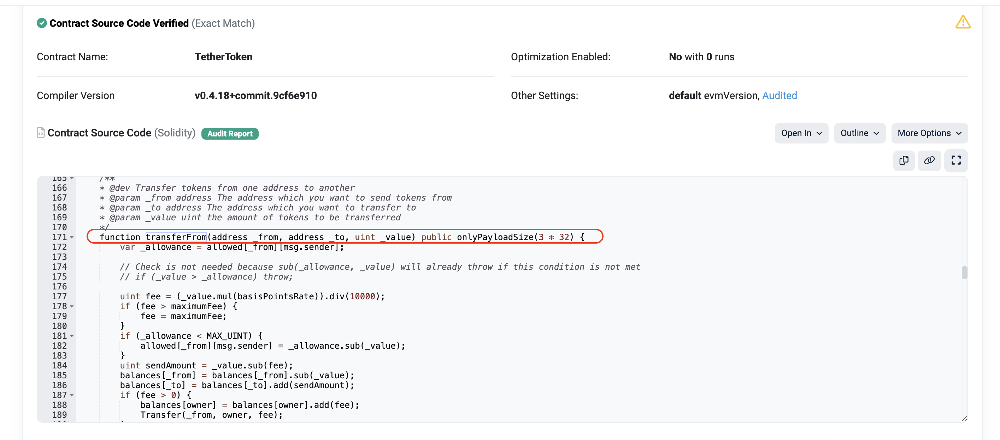

## Why does the SafeERC20 program exist and when should it be used?

- [The issue with USDT](#the-issue-with-usdt)
- [OpenZeppelin's SafeERC20 to the rescue](#openzeppelins-safeerc20-to-the-rescue)
- [Uniswap's TransferHelper.sol](#uniswaps-transferhelpersol)
- [The problem with Solmate's SafeTransferLib.sol](#the-problem-with-solmates-safetransferlibsol)

An ERC20 token is any smart contract that implements the [ERC20 standard](https://eips.ethereum.org/EIPS/eip-20). If a smart contract implements all the fucntions from the ERC20 interface, it is considered as ERC20 token, otherwise not.

Simple, right? However, in reality, there are a lot of smart contracts that you would think are ERC20 tokens, but in reality they are not. One of the most notable is Tether (USDT).

If we take a closer look to the [ERC20 standard](https://eips.ethereum.org/EIPS/eip-20) there are two notable sentences written:

- The following specifications use syntax from Solidity 0.4.17 (or above)
- Callers MUST handle `false` from `returns (bool success)`. Callers MUST NOT assume that `false` is never returned!

### The issue with USDT

With that in mind, let's take a look at the Tether's (USDT) `transferFrom` function signature and part of the implementation.



We can clearly see that it DOES NOT RETURN TRUE/FALSE BOOLEAN VARIABLE. That means that, as a result, its calls in the contract might fail. And, as being said, there are plenty similar "erc20 tokens" that does the same thing.

Now imagine that you want to create a NFT collection and to set the minting price to 1 USDT. Your overly simplified smart contract may look like this:

```solidity
// SPDX-License-Identifier: MIT
pragma solidity ^0.8.20;

import {ERC721} from "./vendor/@openzeppelin/contracts/v5.0.0/token/ERC721/ERC721.sol";
import {IERC20} from "./vendor/@openzeppelin/contracts/v5.0.0/token/ERC20/IERC20.sol";

contract VulnerableNFT is ERC721 {
    uint256 private _nextTokenId;
    address internal immutable s_usdt;
    uint256 internal immutable s_priceInUsdt;

    constructor(address usdt, uint256 priceInUsdt) ERC721("MyToken", "MTK") {
        s_usdt = usdt;
        s_priceInUsdt = priceInUsdt;
    }

    function purchaseNft(address to) public {
        // WARNING: Unchecked return value
        // This should fail due to USDT not being an ERC20 token actually
        IERC20(s_usdt).transferFrom(msg.sender, address(this), s_priceInUsdt);

        uint256 tokenId = _nextTokenId++;
        _safeMint(to, tokenId);
    }
}
```

This implementation assumes that the User that wants to mint an NFT, approved earlier 1 USDT to be spent on their behalf by the NFT smart contract itself. I actually run some tests on a forked Ethereum mainnet environment in Foundry and found out that this implementation does not work due to issues with USDT not implementing the ERC20 standard completely.

[./usdtExploit/test/UsdtBehaviour.t.sol](./usdtExploit/test/UsdtBehaviour.t.sol)

```solidity
// SPDX-License-Identifier: UNLICENSED
pragma solidity ^0.8.13;

import {Test, console2} from "forge-std/Test.sol";
import {IERC20} from "../src/vendor/@openzeppelin/contracts/v5.0.0/token/ERC20/IERC20.sol";
import {SafeERC20} from "./../src/vendor/@openzeppelin/contracts/v5.0.0/token/ERC20/utils/SafeERC20.sol";
import {VulnerableNFT} from "../src/VulnerableNFT.sol";

contract UsdtBehaviourTest is Test {
    using SafeERC20 for IERC20;

    uint256 ethereumMainnetFork;
    uint256 blockNumber = 19262114;
    address usdtContractAddress = 0xdAC17F958D2ee523a2206206994597C13D831ec7;

    VulnerableNFT vulnerableNft;
    uint256 priceInUsdt = 1000000; // 1 USDT
    address alice;
    address bob;

    function setUp() public {
        ethereumMainnetFork = vm.createSelectFork(vm.envString("ETHEREUM_MAINNET_RPC_URL"));
        vm.rollFork(blockNumber);

        vulnerableNft = new VulnerableNFT(usdtContractAddress, priceInUsdt);

        alice = 0xee5B5B923fFcE93A870B3104b7CA09c3db80047A;
        bob = 0xa60Ab75442b88dEb99b0F083D8D6Ea47830139D9;
    }

    function test_ValidateForkSetUp() public {
        /**
         * Block number: 19262114
         * USDT holders:
         * 0xee5B5B923fFcE93A870B3104b7CA09c3db80047A = 206,139,930.422005 USDT
         * 0xa60Ab75442b88dEb99b0F083D8D6Ea47830139D9 = 0 USDT
         */
        assertEq(vm.activeFork(), ethereumMainnetFork);
        uint256 balanceAlice = IERC20(usdtContractAddress).balanceOf(alice);
        uint256 balanceBob = IERC20(usdtContractAddress).balanceOf(bob);

        assertEq(balanceAlice, 206139930422005);
        assertEq(balanceBob, 0);
    }

    function test_shouldMint() public {
        assertEq(vm.activeFork(), ethereumMainnetFork);
        assert(address(vulnerableNft).code.length > 0);
        assert(usdtContractAddress.code.length > 0);

        IERC20(usdtContractAddress).safeApprove(address(vulnerableNft), priceInUsdt);

        vulnerableNft.purchaseNft(address(alice)); // This fails
    }
}
```

### OpenZeppelin's SafeERC20 to the rescue

To mitigate this risk, OpenZeppelin introduced SafeERC20, a wrapper library that standardizes ERC20 interactions, ensuring they conform to expected behaviors. OpenZeppelin's SafeERC20 wraps ERC20 functions to ensure they return success or fail explicitly, making interactions safer.

Assumptions are bad. What basically SafeERC20 does is that it ensures that incorrect token transfers always result in failed transaction/Solidity revert instead of silently continuing with the smart contract funtion execution because `transfer` or `transferFrom` functions do not return true or false boolean value.

So our previous vulnerable NFT smart contract can look like this:

```solidity
// SPDX-License-Identifier: MIT
pragma solidity ^0.8.20;

import {ERC721} from "./vendor/@openzeppelin/contracts/v5.0.0/token/ERC721/ERC721.sol";
import {IERC20} from "./vendor/@openzeppelin/contracts/v5.0.0/token/ERC20/IERC20.sol";
import {SafeERC20} from "./vendor/@openzeppelin/contracts/v5.0.0/token/ERC20/utils/SafeERC20.sol";

contract VulnerableNFT is ERC721 {
    using SafeERC20 for IERC20;

    uint256 private _nextTokenId;
    address internal immutable s_usdt;
    uint256 internal immutable s_priceInUsdt;

    constructor(address usdt, uint256 priceInUsdt) ERC721("MyToken", "MTK") {
        s_usdt = usdt;
        s_priceInUsdt = priceInUsdt;
    }

    function purchaseNft(address to) public {
        IERC20(s_usdt).safeTransferFrom(msg.sender, address(this), s_priceInUsdt);

        uint256 tokenId = _nextTokenId++;
        _safeMint(to, tokenId);
    }
}
```

Conclusion: **When dealing with ERC20 tokens in your smart contract, always use SafeERC20**

### Uniswap's TransferHelper.sol

Similar to SafeERC20, Uniswap developed TransferHelper.sol, library that shares a similar motivation: to facilitate safe and reliable interactions with ERC20 tokens, especially those not fully complying with the standard.

Its implementaion is fairly simple and elegant:

```solidity
// SPDX-License-Identifier: GPL-2.0-or-later
pragma solidity >=0.6.0;

import '../interfaces/IERC20Minimal.sol';

/// @title TransferHelper
/// @notice Contains helper methods for interacting with ERC20 tokens that do not consistently return true/false
library TransferHelper {
    /// @notice Transfers tokens from msg.sender to a recipient
    /// @dev Calls transfer on token contract, errors with TF if transfer fails
    /// @param token The contract address of the token which will be transferred
    /// @param to The recipient of the transfer
    /// @param value The value of the transfer
    function safeTransfer(
        address token,
        address to,
        uint256 value
    ) internal {
        (bool success, bytes memory data) =
            token.call(abi.encodeWithSelector(IERC20Minimal.transfer.selector, to, value));
        require(success && (data.length == 0 || abi.decode(data, (bool))), 'TF');
    }
}
```

### The problem with Solmate's SafeTransferLib.sol

Solmate is a very gas-optimized Solidity library with plenty of good aproaches. However, Solmate's version of SafeERC20 transfers doesn't check if a token address is actually a contract.

```solidity
// SPDX-License-Identifier: AGPL-3.0-only
pragma solidity >=0.8.0;

import {ERC20} from "../tokens/ERC20.sol";

/// @notice Safe ETH and ERC20 transfer library that gracefully handles missing return values.
/// @author Solmate (https://github.com/transmissions11/solmate/blob/main/src/utils/SafeTransferLib.sol)
/// @dev Use with caution! Some functions in this library knowingly create dirty bits at the destination of the free memory pointer.
/// @dev Note that none of the functions in this library check that a token has code at all! That responsibility is delegated to the caller.
library SafeTransferLib {
    /*//////////////////////////////////////////////////////////////
                             ETH OPERATIONS
    //////////////////////////////////////////////////////////////*/

    function safeTransferETH(address to, uint256 amount) internal {
        bool success;

        /// @solidity memory-safe-assembly
        assembly {
            // Transfer the ETH and store if it succeeded or not.
            success := call(gas(), to, amount, 0, 0, 0, 0)
        }

        require(success, "ETH_TRANSFER_FAILED");
    }

    /*//////////////////////////////////////////////////////////////
                            ERC20 OPERATIONS
    //////////////////////////////////////////////////////////////*/

    function safeTransferFrom(
        ERC20 token,
        address from,
        address to,
        uint256 amount
    ) internal {
        bool success;

        /// @solidity memory-safe-assembly
        assembly {
            // Get a pointer to some free memory.
            let freeMemoryPointer := mload(0x40)

            // Write the abi-encoded calldata into memory, beginning with the function selector.
            mstore(freeMemoryPointer, 0x23b872dd00000000000000000000000000000000000000000000000000000000)
            mstore(add(freeMemoryPointer, 4), and(from, 0xffffffffffffffffffffffffffffffffffffffff)) // Append and mask the "from" argument.
            mstore(add(freeMemoryPointer, 36), and(to, 0xffffffffffffffffffffffffffffffffffffffff)) // Append and mask the "to" argument.
            mstore(add(freeMemoryPointer, 68), amount) // Append the "amount" argument. Masking not required as it's a full 32 byte type.

            success := and(
                // Set success to whether the call reverted, if not we check it either
                // returned exactly 1 (can't just be non-zero data), or had no return data.
                or(and(eq(mload(0), 1), gt(returndatasize(), 31)), iszero(returndatasize())),
                // We use 100 because the length of our calldata totals up like so: 4 + 32 * 3.
                // We use 0 and 32 to copy up to 32 bytes of return data into the scratch space.
                // Counterintuitively, this call must be positioned second to the or() call in the
                // surrounding and() call or else returndatasize() will be zero during the computation.
                call(gas(), token, 0, freeMemoryPointer, 100, 0, 32)
            )
        }

        require(success, "TRANSFER_FROM_FAILED");
    }

    function safeTransfer(
        ERC20 token,
        address to,
        uint256 amount
    ) internal {
        bool success;

        /// @solidity memory-safe-assembly
        assembly {
            // Get a pointer to some free memory.
            let freeMemoryPointer := mload(0x40)

            // Write the abi-encoded calldata into memory, beginning with the function selector.
            mstore(freeMemoryPointer, 0xa9059cbb00000000000000000000000000000000000000000000000000000000)
            mstore(add(freeMemoryPointer, 4), and(to, 0xffffffffffffffffffffffffffffffffffffffff)) // Append and mask the "to" argument.
            mstore(add(freeMemoryPointer, 36), amount) // Append the "amount" argument. Masking not required as it's a full 32 byte type.

            success := and(
                // Set success to whether the call reverted, if not we check it either
                // returned exactly 1 (can't just be non-zero data), or had no return data.
                or(and(eq(mload(0), 1), gt(returndatasize(), 31)), iszero(returndatasize())),
                // We use 68 because the length of our calldata totals up like so: 4 + 32 * 2.
                // We use 0 and 32 to copy up to 32 bytes of return data into the scratch space.
                // Counterintuitively, this call must be positioned second to the or() call in the
                // surrounding and() call or else returndatasize() will be zero during the computation.
                call(gas(), token, 0, freeMemoryPointer, 68, 0, 32)
            )
        }

        require(success, "TRANSFER_FAILED");
    }

    function safeApprove(
        ERC20 token,
        address to,
        uint256 amount
    ) internal {
        bool success;

        /// @solidity memory-safe-assembly
        assembly {
            // Get a pointer to some free memory.
            let freeMemoryPointer := mload(0x40)

            // Write the abi-encoded calldata into memory, beginning with the function selector.
            mstore(freeMemoryPointer, 0x095ea7b300000000000000000000000000000000000000000000000000000000)
            mstore(add(freeMemoryPointer, 4), and(to, 0xffffffffffffffffffffffffffffffffffffffff)) // Append and mask the "to" argument.
            mstore(add(freeMemoryPointer, 36), amount) // Append the "amount" argument. Masking not required as it's a full 32 byte type.

            success := and(
                // Set success to whether the call reverted, if not we check it either
                // returned exactly 1 (can't just be non-zero data), or had no return data.
                or(and(eq(mload(0), 1), gt(returndatasize(), 31)), iszero(returndatasize())),
                // We use 68 because the length of our calldata totals up like so: 4 + 32 * 2.
                // We use 0 and 32 to copy up to 32 bytes of return data into the scratch space.
                // Counterintuitively, this call must be positioned second to the or() call in the
                // surrounding and() call or else returndatasize() will be zero during the computation.
                call(gas(), token, 0, freeMemoryPointer, 68, 0, 32)
            )
        }

        require(success, "APPROVE_FAILED");
    }
}
```
