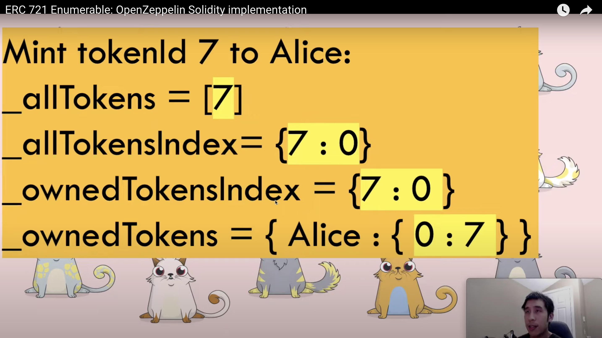
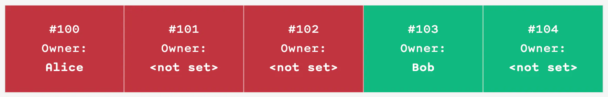

## ERC721A

The goal of ERC721A is to create an implementation of ERC721 which will save significant amount of gas for batch minting of NFTs in a single transaction. One can find its implementation at https://github.com/chiru-labs/ERC721A

### How does ERC721A save gas?

Gas prices on Ethereum has been historically high when there is a high trafic on this blockchain. That was especially true when there were launches of popular NFT projects. Usually when popular NFT projects begin to mint, gas prices spike up, resulting in the entire ecosystem paying millions in gas fees to transact.

- ERC721A saves gas using batch minting, compared to OpenZeppelin's ERC721Enumerable implementation. For the price of minting one single token via the ERC721Enumerable contract, a user can instead mint up to 5 tokens via the ERC721A contract. Take a look at "Measurements" section at https://www.azuki.com/erc721a

- ERC721A token IDs are serially numbered starting from 0 in sequential order (e.g. 0, 1, 2, 3, ...). This "optimization" technique reduces the number of neccesary storage variables.

ERC721Enumerable:

```solidity
 ////////////////////////
/// ERC721Enumerable ///
////////////////////////

// Mapping from token ID to owner address
mapping(uint256 => address) private _owners;

// Mapping owner address to token count
mapping(address => uint256) private _balances;

// Mapping from token ID to approved address
mapping(uint256 => address) private _tokenApprovals;

// Mapping from owner to operator approvals
mapping(address => mapping(address => bool)) private _operatorApprovals;

// Mapping from owner to list of owned token IDs
mapping(address => mapping(uint256 => uint256)) private _ownedTokens;

// Mapping from token ID to index of the owner tokens list
mapping(uint256 => uint256) private _ownedTokensIndex;

// Array with all token ids, used for enumeration
uint256[] private _allTokens;

// Mapping from token id to position in the allTokens array
mapping(uint256 => uint256) private _allTokensIndex;
```

ERC721A:

```solidity
///////////////////
///// ERC721A /////
///////////////////

// Mapping from token ID to ownership details
// An empty struct value does not necessarily mean the token is unowned.
// See {_packedOwnershipOf} implementation for details.
//
// Bits Layout:
// - [0..159]   `addr`
// - [160..223] `startTimestamp`
// - [224]      `burned`
// - [225]      `nextInitialized`
// - [232..255] `extraData`
mapping(uint256 => uint256) private _packedOwnerships;

// Mapping owner address to address data.
//
// Bits Layout:
// - [0..63]    `balance`
// - [64..127]  `numberMinted`
// - [128..191] `numberBurned`
// - [192..255] `aux`
mapping(address => uint256) private _packedAddressData;

// Mapping from token ID to approved address.
mapping(uint256 => TokenApprovalRef) private _tokenApprovals;

// Mapping from owner to operator approvals
mapping(address => mapping(address => bool)) private _operatorApprovals;

// The amount of tokens minted above `_sequentialUpTo()`.
// We call these spot mints (i.e. non-sequential mints).
uint256 private _spotMinted;
```

Now let's see how mint (transfer from address(0) to the receiver's address) function in ERC721Enumerable looks like in terms of storage variables:

```solidity
function _update(address to, uint256 tokenId, address auth) internal virtual override returns (address) {
        address previousOwner = super._update(to, tokenId, auth); // <---- 3 COLD SLOADS, 5 + 2 WARM SLOADS

        if (previousOwner == address(0)) {
            _addTokenToAllTokensEnumeration(tokenId);  // <---- 2 COLD SLOADS, 2 WARM SLOADS
        } else if (previousOwner != to) {
            _removeTokenFromOwnerEnumeration(previousOwner, tokenId);  // <---- 2 COLD SLOADS, 7 WARM SLOADS
        }
        if (to == address(0)) {
            _removeTokenFromAllTokensEnumeration(tokenId);  // <---- 3 COLD SLOADS, 6 WARM SLOADS
        } else if (previousOwner != to) {
            _addTokenToOwnerEnumeration(to, tokenId);  // <---- 2 COLD SLOADS, 3 WARM SLOADS
        }

        return previousOwner;
}
```



Now let's compare it to ERC721A:

```solidity
    function _safeMint(
        address to,
        uint256 quantity,
        bytes memory _data
    ) internal virtual {
        _mint(to, quantity);  // <---- 3 COLD SLOADS, 4 WARM SLOADS

        unchecked {
            if (to.code.length != 0) {
                uint256 end = _currentIndex;
                uint256 index = end - quantity;
                do {
                    if (!_checkContractOnERC721Received(address(0), to, index++, _data)) {
                        _revert(TransferToNonERC721ReceiverImplementer.selector);
                    }
                } while (index < end);
                // This prevents reentrancy to `_safeMint`.
                // It does not prevent reentrancy to `_safeMintSpot`.
                if (_currentIndex != end) revert();
            }
        }
    }
```

- ERC721A updates owner's balance just once, after the bulk while ERC721Enumerable on each single mint. If Alice mints 3 NFTs in a batch, ERC721A changes balances mapping value for Alice's address key from 0 -> 3, instead of 0 -> 1 -> 2 -> 3 saving gas on less SLOAD/SSTORE operations.

- The ERC721A `_safeMint` does not set explicit owners of specific tokenIDs when they are consecutive IDs minted by the same owner. For example, if there are two batch mint calls, one by Alice to mint tokens #100, #101, and #102 all in one call, and another call by Bob to mint tokens #103 and #104, the storage would look like this:



### Where does it add cost?

- The tradeoff of the ERC721A contract design is that transfer transactions (`transferFrom` and `safeTransferFrom`) cost more gas than in ERC721Enumerable.

- Again, the ERC721A `_safeMint` does not set explicit owners of specific tokenIDs when they are consecutive IDs minted by the same owner, meaning that it only has to set the ownership metadata twice: once for the Alice’s batch and once for Bob’s batch.

- However, this means that transferring a tokenID that does not have an explicit owner address set, the contract has to run a loop across all of the tokenIDs until it reaches the first NFT with an explicit owner address to find the owner that has the right to transfer it, and then set a new owner, thus modifying ownership state more than once.

ERC721Enumerable:

```solidity
    function _update(address to, uint256 tokenId, address auth) internal virtual returns (address) {
        address from = _ownerOf(tokenId);

        // Perform (optional) operator check
        if (auth != address(0)) {
            _checkAuthorized(from, auth, tokenId);
        }

        // Execute the update
        if (from != address(0)) {
            // Clear approval. No need to re-authorize or emit the Approval event
            _approve(address(0), tokenId, address(0), false);

            unchecked {
                _balances[from] -= 1;
            }
        }

        if (to != address(0)) {
            unchecked {
                _balances[to] += 1;
            }
        }

        _owners[tokenId] = to;

        emit Transfer(from, to, tokenId);

        return from;
    }
```

ERC721A:

```solidity
    function transferFrom(
        address from,
        address to,
        uint256 tokenId
    ) public payable virtual override {
        uint256 prevOwnershipPacked = _packedOwnershipOf(tokenId);

        // Mask `from` to the lower 160 bits, in case the upper bits somehow aren't clean.
        from = address(uint160(uint256(uint160(from)) & _BITMASK_ADDRESS));

        if (address(uint160(prevOwnershipPacked)) != from) _revert(TransferFromIncorrectOwner.selector);

        (uint256 approvedAddressSlot, address approvedAddress) = _getApprovedSlotAndAddress(tokenId);

        // The nested ifs save around 20+ gas over a compound boolean condition.
        if (!_isSenderApprovedOrOwner(approvedAddress, from, _msgSenderERC721A()))
            if (!isApprovedForAll(from, _msgSenderERC721A())) _revert(TransferCallerNotOwnerNorApproved.selector);

        _beforeTokenTransfers(from, to, tokenId, 1);

        // Clear approvals from the previous owner.
        assembly {
            if approvedAddress {
                // This is equivalent to `delete _tokenApprovals[tokenId]`.
                sstore(approvedAddressSlot, 0)
            }
        }

        // Underflow of the sender's balance is impossible because we check for
        // ownership above and the recipient's balance can't realistically overflow.
        // Counter overflow is incredibly unrealistic as `tokenId` would have to be 2**256.
        unchecked {
            // We can directly increment and decrement the balances.
            --_packedAddressData[from]; // Updates: `balance -= 1`.
            ++_packedAddressData[to]; // Updates: `balance += 1`.

            // Updates:
            // - `address` to the next owner.
            // - `startTimestamp` to the timestamp of transfering.
            // - `burned` to `false`.
            // - `nextInitialized` to `true`.
            _packedOwnerships[tokenId] = _packOwnershipData(
                to,
                _BITMASK_NEXT_INITIALIZED | _nextExtraData(from, to, prevOwnershipPacked)
            );

            // If the next slot may not have been initialized (i.e. `nextInitialized == false`) .
            if (prevOwnershipPacked & _BITMASK_NEXT_INITIALIZED == 0) {
                uint256 nextTokenId = tokenId + 1;
                // If the next slot's address is zero and not burned (i.e. packed value is zero).
                if (_packedOwnerships[nextTokenId] == 0) {
                    // If the next slot is within bounds.
                    if (nextTokenId != _currentIndex) {
                        // Initialize the next slot to maintain correctness for `ownerOf(tokenId + 1)`.
                        _packedOwnerships[nextTokenId] = prevOwnershipPacked;
                    }
                }
            }
        }

        // Mask `to` to the lower 160 bits, in case the upper bits somehow aren't clean.
        uint256 toMasked = uint256(uint160(to)) & _BITMASK_ADDRESS;
        assembly {
            // Emit the `Transfer` event.
            log4(
                0, // Start of data (0, since no data).
                0, // End of data (0, since no data).
                _TRANSFER_EVENT_SIGNATURE, // Signature.
                from, // `from`.
                toMasked, // `to`.
                tokenId // `tokenId`.
            )
        }
        if (toMasked == 0) _revert(TransferToZeroAddress.selector);

        _afterTokenTransfers(from, to, tokenId, 1);
    }
```

- William Entriken, the creator of the ERC721 standard, proposed on Twitter a workaround for reducing gas cost on transfer operations when working with ERC721A:

> 1. Always mint the maximum allowed number of NFTs during the batch mint.
> 2. When transferring, start with the ODD numbered tokens first in ASCENDING order.
> 3. After that, transfer EVEN numbered tokens.
