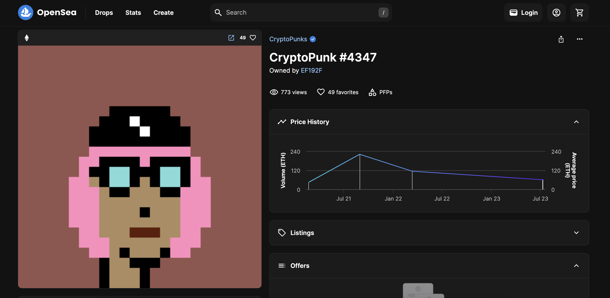

## Owner of NFTs

Revisit the solidity events tutorial. How can OpenSea quickly determine which NFTs an address owns if most NFTs don’t use ERC721 enumerable? Explain how you would accomplish this if you were creating an NFT marketplace

### The problem

Let's start with the ERC721 interface

```solidity
pragma solidity ^0.4.20;

/// @title ERC-721 Non-Fungible Token Standard
interface ERC721 /* is ERC165 */ {
    event Transfer(address indexed _from, address indexed _to, uint256 indexed _tokenId);
    event Approval(address indexed _owner, address indexed _approved, uint256 indexed _tokenId);
    event ApprovalForAll(address indexed _owner, address indexed _operator, bool _approved);

    function balanceOf(address _owner) external view returns (uint256);
    function ownerOf(uint256 _tokenId) external view returns (address);
    function safeTransferFrom(address _from, address _to, uint256 _tokenId, bytes data) external payable;
    function safeTransferFrom(address _from, address _to, uint256 _tokenId) external payable;
    function transferFrom(address _from, address _to, uint256 _tokenId) external payable;
    function approve(address _approved, uint256 _tokenId) external payable;
    function setApprovalForAll(address _operator, bool _approved) external;
    function getApproved(uint256 _tokenId) external view returns (address);
    function isApprovedForAll(address _owner, address _operator) external view returns (bool);
}

interface ERC165 {
    function supportsInterface(bytes4 interfaceID) external view returns (bool);
}

interface ERC721TokenReceiver {
    function onERC721Received(address _operator, address _from, uint256 _tokenId, bytes _data) external returns(bytes4);
}

interface ERC721Metadata /* is ERC721 */ {
    function name() external view returns (string _name);
    function symbol() external view returns (string _symbol);
    function tokenURI(uint256 _tokenId) external view returns (string);
}

interface ERC721Enumerable /* is ERC721 */ {
    function totalSupply() external view returns (uint256);
    function tokenByIndex(uint256 _index) external view returns (uint256);
    function tokenOfOwnerByIndex(address _owner, uint256 _index) external view returns (uint256);
}
```

It's pretty obvious that without using the ERC721Enumerable extension, which is optional, one can the owner of a particular token with a given ID from a particular NFT collection, can get the balance of tokens from a particular NFT collection of a given address, but can't get the which exactly tokens with IDs from a particular NFT collection the given address poses.

### Logs

To solve the problem, one can create a backend service to query EVM event logs for specific events emitted by the NFT smart contract. More precisely, one can start with the empty database/hash table and query `Transfer(address indexed _from, address indexed _to, uint256 indexed _tokenId);` event. On each transfer event, the `_to` address will get `_tokenId` assigned to itself in the database/hash table whilst removing it from the `_from` address entry. The exception will be the `address(0)` because it is associated with minting and burning thus there is no reason to keep the record of NFTs it "owns".

For demonstration purposes, I created the [JavaScript script](./index.js) using the ethers.js library. The script itself is extremely simple, it initializes a new Ethereum mainnet JSON-RPC provider and queries the latest 10000 blocks for the `PunkTransfer` event from the famous `CRYPTOPUNKS` NFT collection.

```js
const provider = getDefaultProvider("mainnet");
const latestBlock = await provider.getBlockNumber();

const _fromBlock = latestBlock - 10000;
const _toBlock = latestBlock;
const _address = "0xb47e3cd837dDF8e4c57F05d70Ab865de6e193BBB";
const eventSignature = "PunkTransfer(address,address,uint256)";
const _topics = id(eventSignature);

const logs = await provider.getLogs({ fromBlock: _fromBlock, toBlock: _toBlock, address: _address, topics: [_topics] });

logs.forEach((log) => {
  console.log(`Address ${log.topics[1]} transferred token with id ${BigInt(log.data).toString()} to address ${log.topics[2]}\n`);

  // handling Map function logic
});
```

The `getLogs` function from ethers.js calls the `eth_getLogs` method from the Ethereum JSON-RPC API spec under the hood, as can be seen here: https://github.com/ethers-io/ethers.js/blob/ad5f1c5fc7b73cfb20d9012b669e9dcb9122d244/src.ts/providers/abstract-provider.ts#L1162

It's important to understand how `eth_getLogs` work under the hood, though: https://ethereum.org/en/developers/docs/apis/json-rpc/#eth_getlogs

It returns an array of all logs matching a given filter object with the options listed below:

- `fromBlock`: QUANTITY|TAG - (optional, default: "latest") Integer block number, or "latest" for the last mined block or "pending", "earliest" for not yet mined transactions.

- `toBlock`: QUANTITY|TAG - (optional, default: "latest") Integer block number, or "latest" for the last mined block or "pending", "earliest" for not yet mined transactions.

- `address`: DATA|Array, 20 Bytes - (optional) Contract address or a list of addresses from which logs should originate.

- `topics`: Array of DATA, - (optional) Array of 32 Bytes DATA topics. Topics are order-dependent. Each topic can also be an array of DATA with "or" options.

- `blockhash`: DATA, 32 Bytes - (optional, future) With the addition of EIP-234, blockHash will be a new filter option which restricts the logs returned to the single block with the 32-byte hash blockHash. Using blockHash is equivalent to fromBlock = toBlock = the block number with hash blockHash. If blockHash is present in the filter criteria, then neither fromBlock nor toBlock are allowed.

```json
params: [
  {
    topics: [
      "0x000000000000000000000000a94f5374fce5edbc8e2a8697c15331677e6ebf0b",
    ],
  },
]
```

Or in our example from the script (notice the `const logs = await provider.getLogs({ fromBlock: _fromBlock, toBlock: _toBlock, address: _address, topics: [_topics] })` function call), the callback looks like this:

```json
  Log {
    provider: FallbackProvider { quorum: 2, eventQuorum: 1, eventWorkers: 1 },
    transactionHash: '0x9087e14def18d65f0199369fb6690610c19137e3735be1677f32ac7d8cf4f38f',
    blockHash: '0x287389beb54646dbc6c2a116e04f30487cf346143c1213aef2426c11d8cc2dd2',
    blockNumber: 19359113,
    removed: false,
    address: '0xb47e3cd837dDF8e4c57F05d70Ab865de6e193BBB',
    data: '0x00000000000000000000000000000000000000000000000000000000000010fb',
    topics: [
      '0x05af636b70da6819000c49f85b21fa82081c632069bb626f30932034099107d8',
      '0x0000000000000000000000000cdb1e900885fadd99d9955f5fb8e9f6acca8bd7',
      '0x000000000000000000000000ef192f0679112786ecc69198cbf59e3a8a286390'
    ],
    index: 328,
    transactionIndex: 109
  }
```

Now, when it comes to callback, we should take a look at `data` and `topics` array fields. Data is the ABI-Encoded or “hashed” non-indexed parameters of the event. Topics is the arrat of indexed parameters of the event. It consists of event signature and up to three parameters which have the `indexed` keyword in Solidity smart contract. Topics are easy to search.

So in our example, we have the following event `PunkTransfer(address indexed from, address indexed to, uint256 punkIndex);`. With the simple analysis we can see that `from` and `to` address we can get from the `topics` and `punkIndex` from the `data` field.

In the above log example, `data` consists of `0x00000000000000000000000000000000000000000000000000000000000010fb` value which is a hexadecimal number. If we convert it to decimal number we get 4347, which is the following punk.



This log esentially means that the address `0x0000000000000000000000000cdb1e900885fadd99d9955f5fb8e9f6acca8bd7` trasnferred token with the id `4347` to the address `0x000000000000000000000000ef192f0679112786ecc69198cbf59e3a8a286390`.

And if you run the [index.js](./index.js) script you should see the following or similar log:

```shell
node index.js
Address 0x000000000000000000000000068b65394ebb0e19dff45880729c77faaf3b5195 transferred token with id 1525 to address 0x00000000000000000000000053a6dcee891f48e6fca9f2df522bd688ed163f4a

Address 0x000000000000000000000000b9eb79e3e735ee636255dd8d65872a1287744e33 transferred token with id 2094 to address 0x000000000000000000000000b88f61e6fbda83fbfffabe364112137480398018

Address 0x000000000000000000000000b9eb79e3e735ee636255dd8d65872a1287744e33 transferred token with id 6518 to address 0x000000000000000000000000b88f61e6fbda83fbfffabe364112137480398018

Address 0x000000000000000000000000b9eb79e3e735ee636255dd8d65872a1287744e33 transferred token with id 6972 to address 0x000000000000000000000000b88f61e6fbda83fbfffabe364112137480398018

Address 0x0000000000000000000000006414258ee299b740c19a11b938afe30a373d1afd transferred token with id 5164 to address 0x000000000000000000000000090af0d7aaffd6c87d1784185d4e962332a72038

Address 0x0000000000000000000000006bf62dad62053eb6a02451bccf78e252c1388685 transferred token with id 8220 to address 0x0000000000000000000000003819400f51e8fff23113af95e057c1e69b16940d

Address 0x000000000000000000000000b7f7f6c52f2e2fdb1963eab30438024864c313f6 transferred token with id 6530 to address 0x000000000000000000000000621f2a5ef987e064e76da1eb378e7193cefc0baa

Address 0x000000000000000000000000621f2a5ef987e064e76da1eb378e7193cefc0baa transferred token with id 6530 to address 0x0000000000000000000000009381ba3e0ed8a8d0e8e59d944e643d3a54228eed

Address 0x0000000000000000000000009381ba3e0ed8a8d0e8e59d944e643d3a54228eed transferred token with id 6530 to address 0x000000000000000000000000b7f7f6c52f2e2fdb1963eab30438024864c313f6

Address 0x000000000000000000000000f639fff07e0ef4e885b9cb298cc5e25d0d7a09b6 transferred token with id 9815 to address 0x000000000000000000000000add5c738d13d4143a49dc55848d09ec0efd1a780

Address 0x000000000000000000000000f834aab38a5c001001819054b9ab2fe9c4a94ebe transferred token with id 3707 to address 0x00000000000000000000000051b99b8c8fb9dbe6fe9d1dd12b30f363e353567c

Address 0x00000000000000000000000051b99b8c8fb9dbe6fe9d1dd12b30f363e353567c transferred token with id 3707 to address 0x000000000000000000000000000000000000003607fce1ac9e043a86675c5c2f

Address 0x000000000000000000000000000000000000003607fce1ac9e043a86675c5c2f transferred token with id 3707 to address 0x000000000000000000000000f834aab38a5c001001819054b9ab2fe9c4a94ebe

Address 0x000000000000000000000000f834aab38a5c001001819054b9ab2fe9c4a94ebe transferred token with id 3707 to address 0x00000000000000000000000051b99b8c8fb9dbe6fe9d1dd12b30f363e353567c

Address 0x00000000000000000000000051b99b8c8fb9dbe6fe9d1dd12b30f363e353567c transferred token with id 3707 to address 0x000000000000000000000000000000000000003607fce1ac9e043a86675c5c2f

Address 0x000000000000000000000000269616d549d7e8eaa82dfb17028d0b212d11232a transferred token with id 7056 to address 0x00000000000000000000000032aa138bf8fce645bcb357dea8238e54e2016fdb

Address 0x000000000000000000000000000000000000003607fce1ac9e043a86675c5c2f transferred token with id 3707 to address 0x000000000000000000000000f834aab38a5c001001819054b9ab2fe9c4a94ebe

Address 0x000000000000000000000000ed01f8a737813f0bda2d4340d191dbf8c2cbcf30 transferred token with id 3707 to address 0x000000000000000000000000c385e90da38f8798f5a5512d415a13c87e0d6265

Address 0x000000000000000000000000c385e90da38f8798f5a5512d415a13c87e0d6265 transferred token with id 3707 to address 0x000000000000000000000000b7f7f6c52f2e2fdb1963eab30438024864c313f6

Address 0x0000000000000000000000000cdb1e900885fadd99d9955f5fb8e9f6acca8bd7 transferred token with id 4347 to address 0x000000000000000000000000ef192f0679112786ecc69198cbf59e3a8a286390

0x0000000000000000000000003819400f51e8fff23113af95e057c1e69b16940d poses: 8220
0x000000000000000000000000621f2a5ef987e064e76da1eb378e7193cefc0baa poses:
0x0000000000000000000000009381ba3e0ed8a8d0e8e59d944e643d3a54228eed poses:
0x000000000000000000000000b7f7f6c52f2e2fdb1963eab30438024864c313f6 poses: 6530,3707
0x000000000000000000000000add5c738d13d4143a49dc55848d09ec0efd1a780 poses: 9815
0x00000000000000000000000051b99b8c8fb9dbe6fe9d1dd12b30f363e353567c poses:
0x000000000000000000000000000000000000003607fce1ac9e043a86675c5c2f poses:
0x000000000000000000000000f834aab38a5c001001819054b9ab2fe9c4a94ebe poses:
0x00000000000000000000000032aa138bf8fce645bcb357dea8238e54e2016fdb poses: 7056
0x000000000000000000000000c385e90da38f8798f5a5512d415a13c87e0d6265 poses:
0x000000000000000000000000ef192f0679112786ecc69198cbf59e3a8a286390 poses: 4347
0x0000000000000000000000001981d84df65f876a30f3babe56b5fd7d0182dd4d poses: 9865
```

### Bloom filters

Credits: https://twitter.com/Web3Coach/status/1418185061942370304

Why searching like this is way faster than going through all of the transactions? It is because of something called the Bloom filter.

Bloom filter is a space-efficient **probabilistic** data structure that is used to test whether an element is a member of a set. It is an optimization technique to avoid expensive database queries for content that is definitely not in the DB.

False positive matches are possible, but false negatives are not – in other words, a query returns either "possibly in set" or "definitely not in set".


In Ethereum, bloom filter solves the question if a contract event happened in a block without storing extra maps.

Not? Next block.
Yes? The node re-executes the transactions from that block, regenerating the logs, and returning the relevant events to the application.


### Other alternative - The Graph

The Graph is an blockchain indexing protocol, and I wrote about it at this Medium article: https://andrej-rakic.medium.com/the-graph-is-awesome-b25c5e6b79da

Here I will display how one can use The Graph to accomplish solving the same problem.
